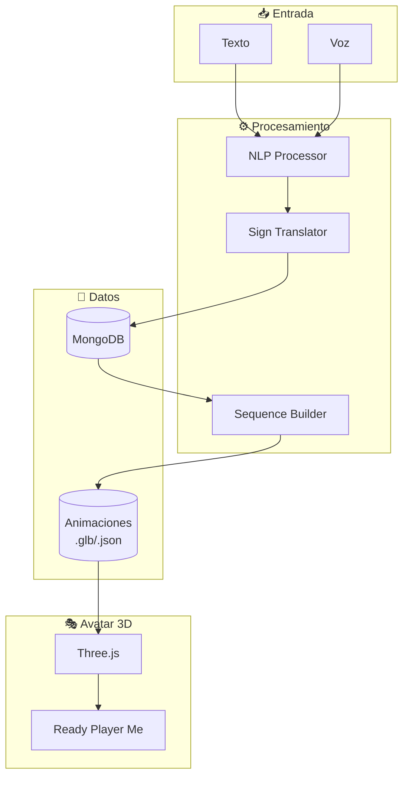

# DominiSigns - Plan de Implementación

## Descripción

Traductor de texto/voz → Lengua de Señas Dominicana (LSRD) mediante **avatar 3D animado**.

---

## Arquitectura del Sistema



---

## Pipeline de Captura de Movimiento

> [!TIP]
> **Tecnología clave: MediaPipe Holistic**
> 
> Extraemos poses 3D directamente de los videos del diccionario LSRD.

```
┌─────────────┐     ┌─────────────┐     ┌─────────────┐     ┌─────────────┐
│   Videos    │────▶│  MediaPipe  │────▶│   Blender   │────▶│  Animación  │
│   LSRD      │     │  Holistic   │     │  Retarget   │     │   .glb      │
└─────────────┘     └─────────────┘     └─────────────┘     └─────────────┘
                          │
                          ▼
                    21 landmarks/mano
                    33 landmarks/cuerpo
                    468 landmarks/cara
```

### Herramientas:

| Componente | Tecnología | Propósito |
|------------|------------|-----------|
| **Pose Extraction** | MediaPipe Holistic | Extrae landmarks 3D de videos |
| **Motion Retarget** | Blender + Script Python | Aplica poses al rig del avatar |
| **Avatar Base** | Ready Player Me / Mixamo | Modelo 3D humanoid rigged |
| **Render Web** | Three.js + React-Three-Fiber | Renderizado en navegador |
| **Animaciones** | GLTF/GLB con clips | Formato optimizado para web |

---

## Estructura del Proyecto

```
DominiSigns/
├── 📁 data/
│   ├── dictionary.json         # Catálogo de señas
│   └── animations/             # Archivos .glb por seña
│       ├── hola.glb
│       ├── gracias.glb
│       └── ...
│
├── 📁 scripts/
│   ├── extract_poses.py        # MediaPipe → JSON keyframes
│   ├── retarget_to_avatar.py   # Keyframes → Blender animation
│   └── batch_export.py         # Exportar todas las animaciones
│
├── 📁 backend/                 # Node.js API
│   └── src/
│       ├── routes/translate.js
│       └── services/nlp.js
│
└── 📁 frontend/                # React + Three.js
    └── src/
        ├── components/
        │   ├── Avatar3D.jsx    # Renderizador del avatar
        │   ├── Translator.jsx  # Input de texto/voz
        │   └── Dictionary.jsx  # Explorador de señas
        └── hooks/
            └── useSignAnimation.js
```

---

## Esquema de Datos

```json
{
  "id": "hola",
  "word": "Hola",
  "category": "saludos",
  "definition": "Interjección de saludo",
  "animation": {
    "file": "animations/hola.glb",
    "duration_ms": 1200,
    "transitions": {
      "in": "neutral_to_sign",
      "out": "sign_to_neutral"
    }
  },
  "variations": ["hola_formal", "hola_grupo"]
}
```

---

## Fases de Desarrollo

### Fase 1: Extracción de Movimiento (2-3 semanas)
- [ ] Script MediaPipe para extraer landmarks de videos
- [ ] Pipeline Blender para retargetear a avatar
- [ ] Procesar 50 señas iniciales (categorías básicas)

### Fase 2: Base de Datos (1 semana)
- [ ] Setup MongoDB con esquema de señas
- [ ] Importar diccionario completo (700+ palabras)
- [ ] API endpoints para búsqueda

### Fase 3: Frontend Avatar (2 semanas)
- [ ] Integrar avatar Ready Player Me
- [ ] Componente React-Three-Fiber para animación
- [ ] Sistema de cola de animaciones con transiciones

### Fase 4: Traductor NLP (2 semanas)
- [ ] Tokenizador de texto español
- [ ] Mapper palabra → seña (con fallback a deletreo)
- [ ] Reconocimiento de voz (Web Speech API)

### Fase 5: Pulido (1 semana)
- [ ] Transiciones suaves entre señas
- [ ] Expresiones faciales
- [ ] Velocidad ajustable

---

## Verificación

| Tipo | Método |
|------|--------|
| **Técnico** | Unit tests, E2E browser tests |
| **Lingüístico** | Revisión con intérpretes LSRD |
| **Usabilidad** | Pruebas con comunidad sorda (ANSORDO) |

---

## Próximos Pasos

1. ✅ Confirmar acceso a videos oficiales
2. ⬜ Obtener avatar base (Ready Player Me o diseño propio)
3. ⬜ Crear script de extracción MediaPipe
4. ⬜ Procesar primeras 10 señas como prueba de concepto
